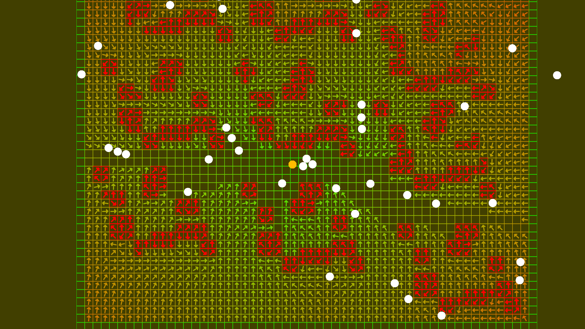

# 2D Survivor Unity Dots Flowfield
A Unity Dots solution for a 2D Flowfield for a Survivor style game written in C#

### Features
* Single grid / Single target
* Built around obstacles bounds
* Axis-free direction vectors
* Line of sight / Next to obstacle data
* Works worldwide for agents and target

